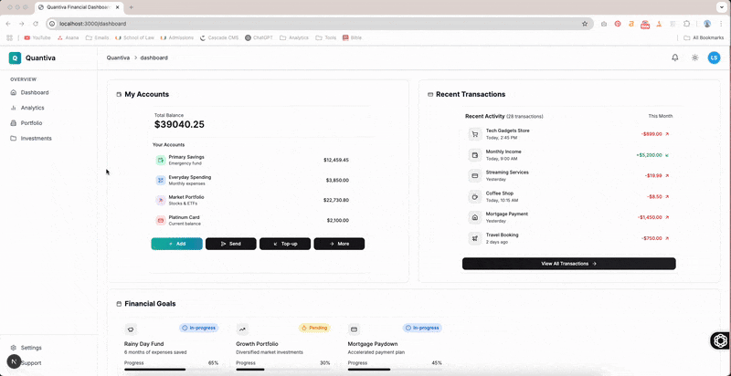

# Quantiva: A Financial Dashboard 📊

A responsive finance dashboard built with **Next.js**, **Tailwind CSS**, and **TypeScript**. The UI is designed to display account balances, recent transactions, and quick actions, with built-in **light/dark mode toggle**.

## ✨ Features

- Account summary with individual balances
- Recent transaction history with filters
- Light and Dark Mode toggle
- Built with Next.js App Router
- Styled with Tailwind CSS and shadcn/ui components
- Modular file structure with reusable components and hooks
- Toggle between dark and light themes using the built-in theme switcher in the top-right corner.

## 🚧 Future Improvements

- Add user authentication
- Connect to real financial APIs (e.g., Plaid)
- Allow users to add, edit, and delete transactions
- Analytics section with graphs and trends
